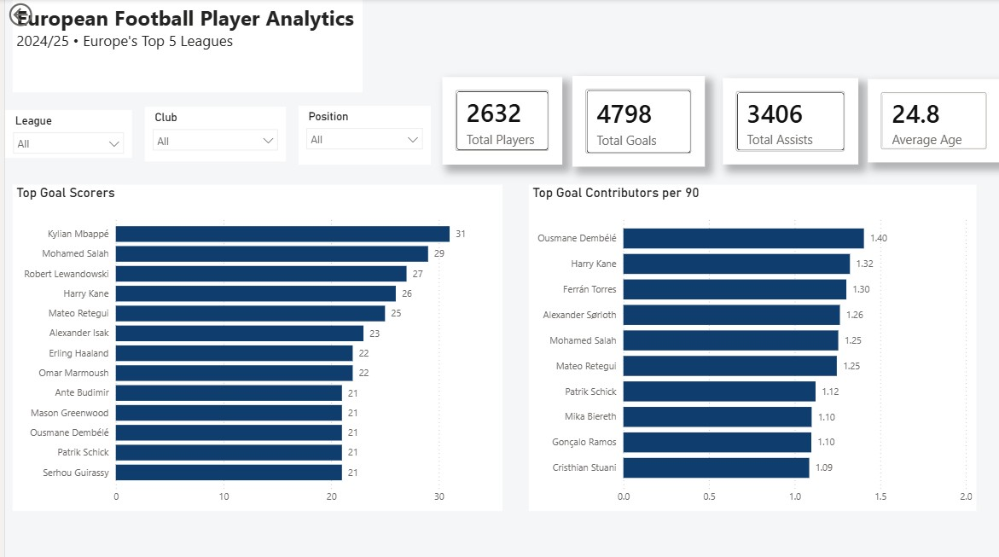
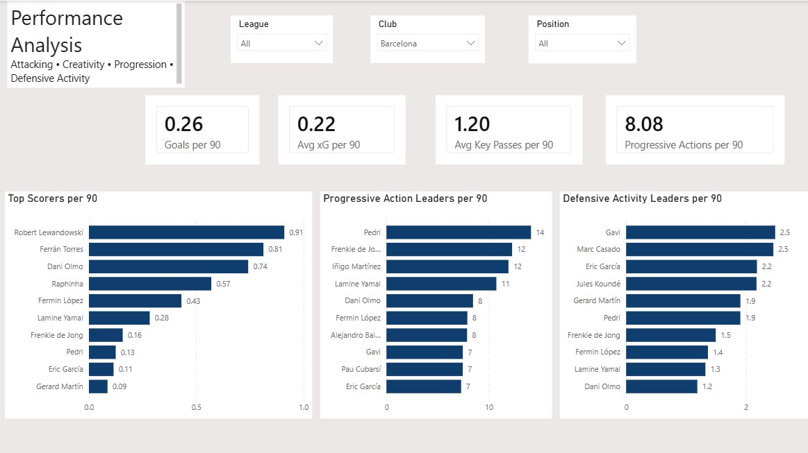
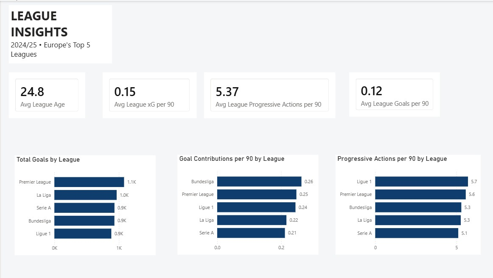

# European Football Player Analytics

An end-to-end data analytics project analyzing player performance across Europe's Top 5 football leagues during the 2024/25 season.

The project transforms raw player statistics into analysis-ready data using Python and Pandas, engineers performance metrics for fair player comparisons, explores the data with SQL, and presents the results through interactive Power BI dashboards.

## Dashboard

### Player Overview

An overview of player performance across Europe's Top 5 leagues, featuring league, club, and position filtering alongside scoring and goal-contribution leaderboards.



### Performance Analysis

Analysis of attacking, progressive, and defensive performance using per-90 metrics. A 900-minute threshold is applied to player leaderboards to reduce small-sample bias.



### League Insights

League-level comparison of scoring output, goal contributions, progressive activity, expected goals, and other performance metrics.



## Key Insights

- The Premier League recorded the highest total goals across the five leagues.
- The Bundesliga produced the highest average goal contributions per 90.
- Ligue 1 recorded the highest average progressive actions per 90.
- Per-90 leaderboards use a minimum 900-minute threshold to make player comparisons more meaningful.
- The dashboards allow performance to be explored across league, club, and position.

## Project Pipeline

```text
Raw Player Data
      ↓
Python / Pandas
      ↓
Data Cleaning
      ↓
Feature Engineering
      ↓
Analysis Exports
      ↓
SQLite Database
      ↓
SQL Analysis
      ↓
Power BI + DAX
      ↓
Interactive Dashboards
```

### 1. Data Loading

Loaded and inspected player-level statistics from the 2024/25 season to understand the dataset structure, available metrics, leagues, and missing values.

### 2. Data Cleaning

Prepared the dataset for analysis by:

- selecting relevant performance metrics
- focusing on outfield players
- checking duplicate records
- handling missing values based on their statistical meaning
- producing a clean analysis-ready dataset

### 3. Feature Engineering

Created derived metrics for more meaningful player comparisons, including:

- goals per 90
- assists per 90
- goal contributions per 90
- expected goals per 90
- key passes per 90
- progressive actions per 90
- tackles per 90
- interceptions per 90
- recoveries per 90

### 4. Analysis Exports

Generated reusable datasets containing:

- league summaries
- top scorers
- top goal contributors per 90
- top progressive players per 90

### 5. SQL Analysis

Loaded the processed data into SQLite and used SQL to explore the dataset through:

- filtering and sorting
- aggregate functions
- `GROUP BY`
- `HAVING`
- player rankings
- league-level comparisons
- performance analysis queries

### 6. Power BI

Built a three-page interactive Power BI report:

**Player Overview**
- headline player statistics
- top goal scorers
- top goal contributors per 90
- league, club, and position filters

**Performance Analysis**
- attacking metrics
- creative metrics
- progressive actions
- defensive activity
- minimum-minute filtering

**League Insights**
- total goals by league
- goal contributions per 90
- progressive actions per 90
- league-level KPI comparisons

## Project Structure

```text
european-football-player-analytics/
│
├── data/
│   ├── analysis/
│   │   ├── league_summary.csv
│   │   ├── top_goal_contributors_per_90.csv
│   │   ├── top_progressors_per_90.csv
│   │   └── top_scorers.csv
│   │
│   ├── processed/
│   │   ├── clean_players.csv
│   │   └── players_with_features.csv
│   │
│   └── raw/                       # Ignored by Git
│
├── images/
│   ├── Player_Overview.jpg
│   ├── Performance_Analysis.jpg
│   └── League_Insights.jpg
│
├── powerbi/
│   └── european_football_analytics.pbix
│
├── scripts/
│   ├── 01_load_data.py
│   ├── 02_clean_data.py
│   ├── 03_feature_engineering.py
│   └── 04_export_data.py
│
├── sql/
│   ├── queries/
│   │   ├── 01_basic_queries.sql
│   │   ├── 02_aggregate_queries.sql
│   │   ├── 03_performance_analysis.sql
│   │   └── 04_advanced_queries.sql
│   │
│   └── create_database.py
│
├── .gitignore
├── README.md
└── requirements.txt
```

## Technologies

- **Python** — data processing and analysis
- **Pandas** — cleaning, transformation, aggregation, and feature engineering
- **SQLite** — relational storage for processed player data
- **SQL** — querying, aggregation, ranking, and performance analysis
- **Power BI** — interactive dashboard development
- **DAX** — dashboard measures and calculated metrics
- **Git & GitHub** — version control and project documentation

## Dataset

The analysis uses player-level statistics from the **2024/25 season** across Europe's Top 5 domestic leagues:

- Premier League
- La Liga
- Serie A
- Bundesliga
- Ligue 1

The raw dataset is excluded from version control. Processed datasets and analysis outputs generated by the project are included in the repository.

## Methodology Note

Raw totals and per-90 statistics answer different questions.

Total statistics are used when analyzing overall season production, while per-90 metrics are used when comparing performance rates between players with different playing time.

For player per-90 leaderboards, a **900-minute minimum** is applied to reduce distortion from players with very small sample sizes.